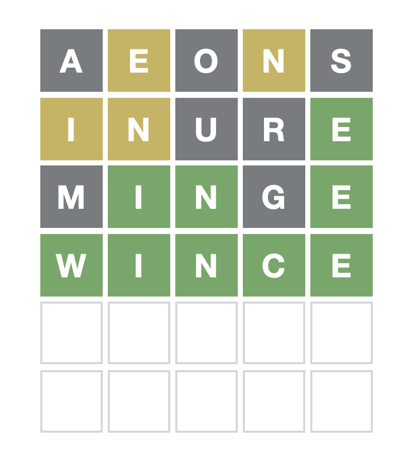

## How it works

At each step, the AI picks the word that has the highest probability of resulting
in a single letter hit.

## Guide

To run the AI:

```sh
python run.py
```

The AI will suggest the word to enter. After entering the suggested word,
enter the outcome (e.g. if everything is grey, then the outcome is `00000`).
The AI will then suggest the next word to enter.

Sample run (wordle 217):

```sh
outcome is string of format: (0|1|2){5}, where 0=grey, 1=yellow, 2=green

{'word': 'aeons', 'hit_probability': 0.9518155547179293}
outcome: 01010
{'word': 'inure', 'hit_probability': 0.8672199170124482}
outcome: 11002
{'word': 'minge', 'hit_probability': 0.43478260869565216}
outcome: 02202
{'word': 'wince', 'hit_probability': 0.5}
outcome: 22222
```


